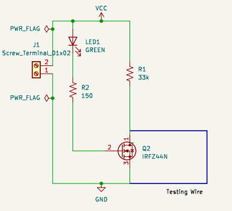

# PCB-DESIGN
## Working
I have designed wire breaking indicator circuit layout on PCB using KiCAD software . If there is any break
in the wire , the circuit indicates wire breakage by glowing of LED. 

## Components Used :
1) IRFZ44N MOSFET -1
2) LED-1
3) 33k(RESISTOR)-1
4) 150k(RESISTOR)-1
5) WIRE

##   Schematic Diagram
The schematic diagram of the circuit is 

## Video demonstrating the working of PCB.

[Watch the video](https://drive.google.com/file/d/16Ncxjm3U25_dvyPrGxnD5pfZJSPH5DQe/view?usp=drive_link)

