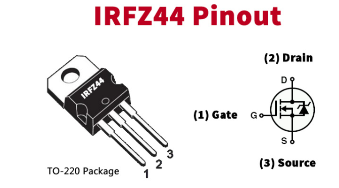
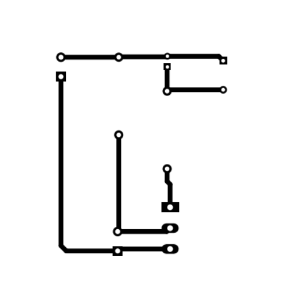
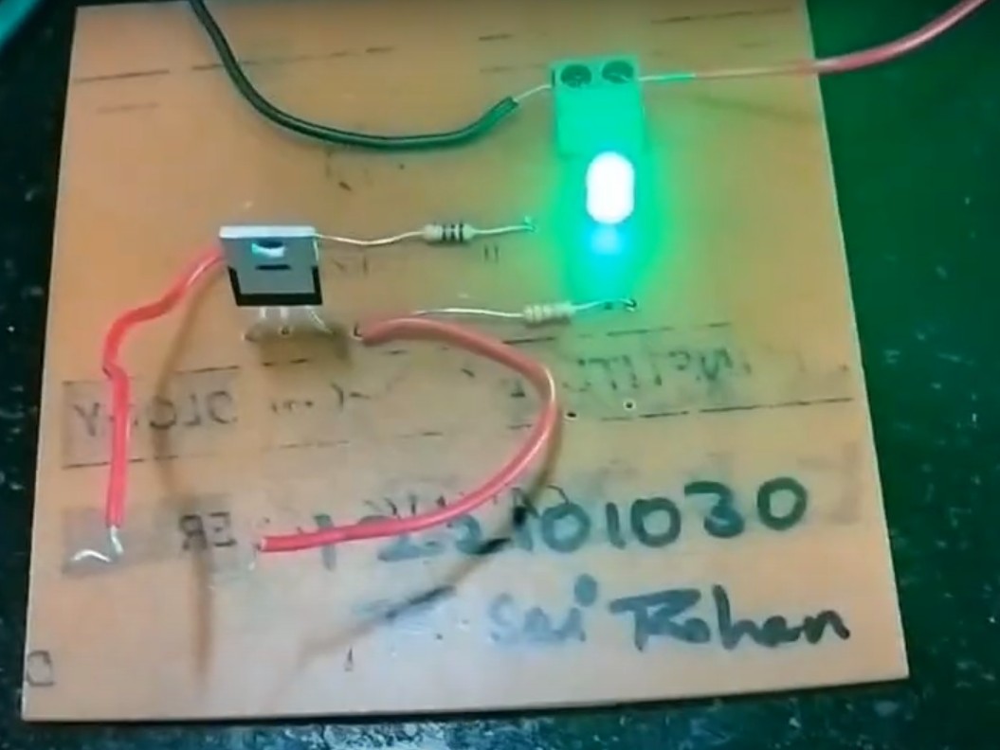

# PCB-DESIGN
## Components Used :

1) IRFZ44N MOSFET -1
2) LED-1
3) 33k(RESISTOR)-1
4) 150k(RESISTOR)-1
5) WIRE

##   Schematic Diagram

## Working
In this Wire Break Alarm Circuit, initially when the power is given, the current flows from Vcc to the ground through the loop wire. When we disconnect or cut the wire, the current starts to flow from Vcc to the gate pin of MOSFET. This triggers the MOSFET and the current starts flowing from drain to source. Hence, power up the connected load. In our indicator circuit load is LED . So LED glows . This will notify the device owner that the internal circuit has been broken

## Footprint  of the circuit after implementing in KiCADD software.

##Circuit Diagram on PCB

## Video demonstrating the working of PCB.

[Watch the video](https://drive.google.com/file/d/16Ncxjm3U25_dvyPrGxnD5pfZJSPH5DQe/view?usp=drive_link)

